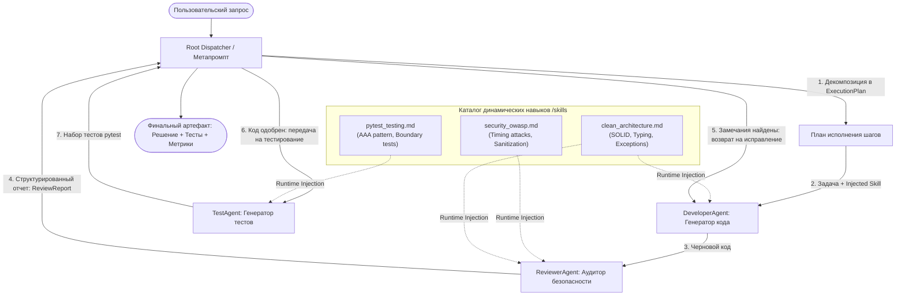

# LLM Harness Engineering

> **Архитектура исполнительного контура (Harness)**: метапромпты, иерархические субагенты, динамические навыки (Skills Injection) и цикл обратной связи (Feedback Loop).

---

## 1. Архитектура системы



---

## 2. Каталог динамических навыков (`/skills`)

Навыки оформлены в виде модульных декларативных файлов со структурированными метаданными (YAML frontmatter) и строгими инженерными предписаниями:

| Файл навыка | Версия | Целевые роли | Описание и фокус |
| :--- | :---: | :---: | :--- |
| [`skills/security_owasp.md`](skills/security_owasp.md) | `1.2.0` | `reviewer`, `developer` | Стандарты безопасности OWASP: защита от атак по времени (timing attacks через `hmac.compare_digest`), криптографическая стойкость (`secrets`), валидация входных границ и предотвращение утечек данных. |
| [`skills/clean_architecture.md`](skills/clean_architecture.md) | `1.1.0` | `developer`, `reviewer` | Инженерные стандарты: принципы SOLID, интерфейсная изоляция, строгая типизация Python (Type Hints), кастомная иерархия доменных исключений. |
| [`skills/pytest_testing.md`](skills/pytest_testing.md) | `1.0.0` | `tester` | Шаблоны модульного тестирования: строгая структура Arrange-Act-Assert (AAA), параметризация, тестирование граничных значений, проверка исключений (`pytest.raises`). |

### Механизм Runtime-инъекции:
`SkillRegistry` парсит каталог при инициализации. Когда диспетчер запускает субагента, он запрашивает у реестра нужные скиллы. Реестр компилирует нормализованный системный блок:
```text
================================================================================
RUNTIME INJECTED SKILLS & DOMAIN STANDARDS:
The following specialized methodologies and rules are active for this execution.
You MUST adhere strictly to all guidelines specified below.
================================================================================
### SKILL: OWASP Secure Coding & Vulnerability Audit Standards (v1.2.0)
... (правила и чек-листы) ...
```
Этот блок динамически добавляется к системному промпту агента только на время выполнения конкретного шага.

---

## 3. Быстрый старт и запуск

Проект написан на чистом **Python 3.10+** и поддерживает 3 режима работы с LLM:

### 1. Установка зависимостей
```bash
pip install -r requirements.txt
```

---

### 2. Выбор и переключение LLM-провайдера

Переключение осуществляется через CLI-параметр `--provider [mock|local|openai]` или через переменную окружения `LLM_PROVIDER` в `.env` (шаблон в `.env.example`).

#### Вариант А: Mock-режим 
```bash
python main.py --provider mock
```

#### Вариант Б: Локальная LLM (Ollama / LM Studio / vLLM)
Позволяет запускать локальные модели (например, Google Gemma или Qwen) без отправки данных в облако:
```bash
# 1. Убедитесь, что запущен Ollama:
ollama list

# 2. Запуск Harness с локальной моделью (по умолчанию используется gemma4:12b на http://localhost:11434/v1):
python main.py --provider local --model gemma4:12b

# Можно указать любую другую установленную модель (например, qwen2.5:32b или llama3.2):
python main.py --provider local --model qwen2.5:32b
```
*(Для LM Studio укажите в `.env` параметр `LOCAL_LLM_BASE_URL=http://localhost:1234/v1`).*

#### Вариант В: Cloud API (OpenAI / Groq / OpenRouter)
```bash
export OPENAI_API_KEY="sk-..."
python main.py --provider openai --model gpt-4o-mini
```

---

### 3. Дополнительные опции CLI

```bash
# Запуск конкретного тест-кейса:
python main.py --case 1          # Тест-кейс 1: Безопасный менеджер сессионных токенов
python main.py --case 2          # Тест-кейс 2: Thread-Safe LRU кэш с TTL
python main.py --case all        # Прогон всех кейсов подряд

# Сохранение сгенерированного кода и тестов на диск в папку ./output:
python main.py --provider mock --save

# Запуск своего произвольного требования:
python main.py --provider mock --request "Разработай безопасный Rate Limiter с алгоритмом Token Bucket"
```

---

## 4. Демонстрация работы (Лог консоли)

Ниже приведен реальный лог исполнения сценария `Case 1: Secure Session Token Manager`:

```text
╭────────────────── === LLM HARNESS EXECUTION ENVIRONMENT === ──────────────────╮
│ Project:         Talent Hub LLM Harness Engineering                           │
│ Target Domain:   Software Engineering                                         │
│ LLM Provider:    MOCK                                                         │
│ Active Model:    deterministic-mock-v1                                        │
│ AI Core:         Hierarchical Sub-Agents & Dynamic Skills Injection           │
╰───────────────────────────────────────────────────────────────────────────────╯
Loaded 3 modular skills from /skills catalog: security_owasp, clean_architecture, pytest_testing

>>> New Task Received: Design and implement a production-grade Secure Session Token Manager in Python...

                        Root Orchestrator Execution Plan                        
┏━━━━━━┳━━━━━━━━━━━━━━━┳━━━━━━━━━━━━━━━━━━━━━━━━━━━━━┳━━━━━━━━━━━━━━━━━━━━━━━━┓
┃ Step ┃ Subagent Role ┃ Dynamically Injected Skills ┃ Step Objective         ┃
┡━━━━━━╇━━━━━━━━━━━━━━━╇━━━━━━━━━━━━━━━━━━━━━━━━━━━━━╇━━━━━━━━━━━━━━━━━━━━━━━━┩
│ 1    │ DEVELOPER     │ clean_architecture          │ Initial Implementation │
│ 2    │ REVIEWER      │ security_owasp, clean_arch  │ Security & SE Audit    │
│ 3    │ TESTER        │ pytest_testing              │ Comprehensive Tests    │
└──────┴───────────────┴─────────────────────────────┴────────────────────────┘

⚡ Runtime Skill Injection -> Target: DeveloperAgent
   Active Skill Guidelines: clean_architecture
  ▶ Executing DeveloperAgent...
  ✔ Finished DeveloperAgent in 0.012s

⚡ Runtime Skill Injection -> Target: ReviewerAgent
   Active Skill Guidelines: security_owasp, clean_architecture
  ▶ Executing ReviewerAgent (Iteration 1)...
╭─────────────── ✘ REVIEW REJECTED: ISSUES FOUND (Iteration 1) ────────────────╮
│ Severity │ Skill / Rule Violated               │ Description                 │
│ CRITICAL │ security_owasp / Timing Attack      │ stored_id == token_id uses  │
│          │                                     │ naive equality comparison   │
│ WARNING  │ security_owasp / Input Validation   │ No max length constraint    │
╰──────────────────────────────────────────────────────────────────────────────╯

↺ [Feedback Loop] Dispatcher detected critical issues.
Returning code and review findings to DeveloperAgent for remediation pass #1...

  ✔ DeveloperAgent applied remediation. Re-submitting to ReviewerAgent...
  ▶ Executing ReviewerAgent (Iteration 2)...
╭─────────────────── ✔ CODE REVIEW PASSED (Iteration 2) ────────────────────────╮
│ All critical security and architecture concerns resolved. Code adheres        │
│ strictly to OWASP guidelines and Clean Architecture.                          │
╰───────────────────────────────────────────────────────────────────────────────╯

⚡ Runtime Skill Injection -> Target: TestAgent
   Active Skill Guidelines: pytest_testing
  ▶ Executing TestAgent...
  ✔ Finished TestAgent in 0.015s

╭───────────────── ✔ HARNESS PIPELINE EXECUTION SUCCESSFUL ─────────────────────╮
│ Total Duration: 0.08s | Code Review History: 2 round(s)                       │
│ Generated Code: 2940 chars | Tests: 2180 chars                                │
╰───────────────────────────────────────────────────────────────────────────────╯
```

---

## 5. Запуск тестов контура

Для проверки целостности Harness, валидации схемы навыков и контрактов:
```bash
pytest tests/ -v
```
